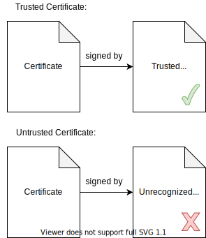
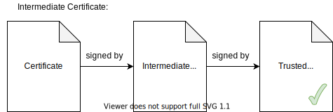
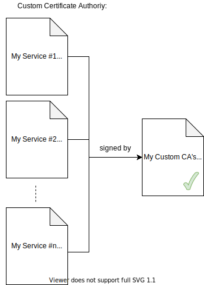

+++
title = "OpenSSL Certificate Authority"
+++

## Overview
At this point, HTTPS (HTTP encrypted with SSL/TLS) is nearly ubiquitous across the internet. You could say that any website that doesn't use HTTPS is behind the times. However, encrypting internet communications only achieves privacy from snooping third parties. In order to prevent "man in the middle" attacks, where an imposter pretends to represent the website you're trying to visit (and tricks you into giving them your passwords, secret data, etc.), it's also necessary to ensure that you're actually communicating with the website that you think you're communicating with. In other words, there needs to be a system in place that enables you to verify the identity of every website that you visit. The current system used on the internet involves certificates (objects that "prove" the identity of a website) and certificate authorities (entities that you trust).

### Motivation
On my home network, I run a few HTTPS services for miscellaneous things. In the past, I have generated a one-off, "self-signed" certificate for each of these services and clicked through the browser warning about the untrusted, self-signed certificate that every service presented.

However, the browser warning should not be taken lightly. If, every time, I blindly click through the warning about the self-signed certificate (without actually checking that the certificate matches what I would expect), then I am vulnerable to a man in the middle attack. If I blindly trust every certificate, there is no difference between a valid and an invalid certificate.

In order to solve this problem, I created a certificate authority for my internal home network HTTPS services. By configuring my browser to trust my certificate authority, the warnings disappear (as long as the certificates presented are actually valid). Now, any browser warning is an actual cause for concern (as it should be).

Originally, I considered taking this project on for security reasons, but quite honestly, the threat model that accounts for the presence of an actual man in the middle attack within my internal home network is quite dubious. More realistically, I learned a lot with this project and (here's the real benefit) now I no longer need to click through annoying browser warnings whenever I visit the HTTPS services on my home network. Additionally, if I ever expose any of my services on the public internet, I could continue to use my personal certificate authority to enable HTTPS.

### How Does it Work?
When I browse to a website, how does my browser know that I am actually communicating with that website (and not someone else pretending to be that website)? The answer lies in the root certificates that are trusted by my browser.

By default, most browsers trust a number of root certificates. These root certificates are owned and managed by organizations who serve as "certificate authorities". Certificate authorities approve and revoke certificates. Supposedly, certificate authorities perform their due diligence to ensure that they only approve and sign certificates when the entity requesting the certificate is the actual owner of the website.

It is (theoretically and/or practically) impossible for someone to forge a signed certificate without a copy of the certificate authority private key. So, when my browser verifies a website's certificate, it checks that the certificate presented by the website is "signed" by a root certificate that the browser trusts. As long as a trusted root certificate authority approved and signed the website's certificate, then my browser trusts the website. Now, the browser warnings about my one-off, self-signed certificates make sense. The browser warns whenever it encounters a certificate that was not signed by a trusted root certificate.



However, in reality, it's slightly more complicated than the picture above. In most cases, there are probably multiple certificates that form a chain back to the root certificate. For example, the certificate from the website would be signed by an "intermediate" certificate authority, which is then signed by a root certificate authority. As long as the chain of signed certificates ends in a root certificate that my browser trusts, the website is trusted.



So, with that background information, I can describe this project in a little more detail. Using the OpenSSL free cryptography software, I created my own root certificate and used that root certificate to sign a number of leaf certificates for the various services running on my internal home network. Therefore, I am now acting as my own certificate authority. Next, I configured my browser to "trust" my personal root certificate. Now, whenever I browse to any of my internal HTTPS services, my browser no longer warns about the certificate because I have made it become trusted by my browser.



## Process
Standing up a personal certificate authority does not require a ton of work per se. It requires running only a handful of different commands. Every step can be performed with the openssl command line utility. However, openssl is a complicated program with a steep learning curve. In addition to the dozens of sub-commands and command line flags, the program reads a rather large configuration file for instructions that affect its behavior.

After quite a bit of experimentation and documentation reading, I created a (hopefully) suitable configuration file for the purposes of my personal CA. First, I will explain my configuration file. Then, I will demonstrate the few commands needed to generate a root certificate and sign a leaf certificate.

### 1. Setup Config File
By reading the default openssl config file (located at `/etc/ssl/openssl.cnf` on my system) and the openssl manual pages related to certificate requests and authorities ([req](https://www.openssl.org/docs/man1.1.1/man1/req.html), [ca](https://www.openssl.org/docs/man1.1.1/man1/ca.html), and [x509v3_config](https://www.openssl.org/docs/man1.1.1/man5/x509v3_config.html)), I learned about the configuration options and their meanings. Then, through some experimentation (trial and error), I made a basic openssl config file.

#### Request Configuration
```
[ req ]
string_mask = utf8only
prompt = no
distinguished_name = req_distinguished_name
```

The "req" section configures the behavior of the req sub-command and therefore affects how openssl generates certificate requests (both CA certificate requests and leaf certificate requests).

  * `string_mask = utf8only` masks the request to produce only utf8 characters. This is the recommended setting (according to the openssl docs, "this is the PKIX recommendation in RFC2459 after 2003").
  * `prompt = no` disables "interactive mode". The utility will not prompt for the DN (distinguished name) values on the command line interactively. Instead, the "distinguished_name" config option specifies a config section that contains the DN values to include in the request.
  * `distinguished_name = req_distinguished_name` specifies the section containing the DN values. So, let's take a look at the "req_distinguished_name" section next.

```
[ req_distinguished_name ]
C = US
ST = Colorado
L = Denver
O = 0xC45
CN = Jason Vigil
emailAddress = jason@0xc45.com
```

The "req_distinguished_name" section specifies the DN (distinguished name) values for my certificate requests. Here, I give some information about where I am located (my country, state, and locale), my "organization name", my common name, and my email. The CA copies this information from certificate requests to signed certificates. Then, anyone can inspect a certificate and identify who it belongs to. Although, for a personal certificate authority, these values may not matter all that much.

#### CA Configuration
```
[ ca ]
default_ca = ca_default
```

The "ca" section configures the openssl "ca" sub-command. This section affects how the certificate authority behaves when signing certificate requests. It contains only one config value. The `default_ca` option sets the default section to use for the CA configuration. This value may be overridden on the command line, causing openssl to utilize a different section for configuration. However, for my purposes, I only need one type of CA configuration. So, the `ca_default` section contains most of the configuration for my CA.

```
[ ca_default ]
dir = ./ca
certificate = $dir/ca.cert.pem
private_key = $dir/private/key.pem
new_certs_dir = $dir/certs
database = $dir/index.txt
serial = $dir/serial

name_opt = ca_default
cert_opt = ca_default

default_days = 30
default_md = sha256
copy_extensions = copy
unique_subject = no
preserve = no
policy = policy_match
```

This is the largest section in my config file (and, this is a super simple CA configuration). With additional features (OCSP, certificate revoke capabilities, etc), it could be much more complicated.

  * The first group of configuration options refer to the CA directory structure. They specify the locations of important files, like the CA cert, private key, etc. These settings must match the directory structure on disk where the utility runs.

  * The next two options (`name_opt` and `cert_opt`) configure how certificates are displayed by the openssl command line utility. The ca_default setting directs the openssl command line utility to print in the default format whenever instructed to output certificate information. I don't have any reason to change this default behavior.

The following options affect the behavior of the CA when signing certificate requests.

  * `default_days = 30` gives new certificates a lifespan of 30 days (by default). After 30 days from the time of signing, a certificate becomes invalid. It is possible to override this value on the command line with the "-days" flag.

  * `default_md = sha256` sets the default message digest for signing the certificate requests to sha256. Rather than use the default value (which leaves it up to the implementation), I decided to manually set the value to sha256. On one of my machines, I noticed the implementation used sha1 as the default. I opted to override the default in order to standardize and ensure the use of the newer sha256 algorithm.

  * `copy_extensions = copy` copies extensions from the certificate request (that aren't already present) to the signed certificate. This setting allows the certificate requester to specify the extensions they want applied to the signed certificate. Later on, you will see that I take advantage of this setting for every leaf certificate request to specify an extension containing a "subjectAltName" value. The CA copies the extension to the signed certificate because of this configuration setting.

  * `unique_subject = no` allows multiple signed certificates to have the same subject. The documentation recommends this setting in order to make CA certificate roll-over easier. I'm not sure that it will ever matter for my purposes, but I couldn't see the harm in allowing multiple certificates with the same subject, so I went with the recommended value.

  * `preserve = no` is a fairly confusing option. I think that it was originally intended to ensure that the ordering of the fields in the DN section remains consistent for all signed certificates. However, confusingly, it also means that any fields present in the certificate request DN that are not present in the CA policy (which we'll discuss next) are silently omitted in the signed certificate.

  * `policy = policy_match` refers to yet another section in the configuration file that sets some basic validation policies for certificate requests. So, let's look at that section now.

```
[ policy_match ]
countryName = match
stateOrProvinceName = match
organizationName = match
commonName = match
emailAddress = match
```

When the CA uses this policy, it enforces a highly restrictive set of rules for the DN values of certificate requests: all certificate requests must contain the exact same DN values as the CA certificate. Otherwise, the CA will refuse to sign the request. This is fine for my purposes because I am the only user of my CA. Every certificate request that I want to sign will have a matching DN section anyway.

There are several values allowed for the fields in this section. Rather than `match`, one could enforce that a certain value is `supplied`. Or, it could be set to `optional`. Also, remember, with the `preserve = no` setting in the CA configuration section, any field not specified in the policy section is silently omitted in the signed certificate.

#### CA Certificate Configuration
```
[ ca_extensions ]
basicConstraints = critical,CA:true,pathlen:0
subjectKeyIdentifier = hash
authorityKeyIdentifier = keyid:always
keyUsage = keyCertSign
```

This section specifies additional configuration (beyond the "ca_default" section) for producing a CA certificate. When creating a CA certificate with the "openssl ca" command, I manually include this section with the "-extensions" flag.

  * `basicConstraints = critical,CA:true,pathlen:0` sets the configuration for the multi-valued "basicConstraints" extension using "short form" syntax.
    * `critical` makes "basicConstraints" a critical extension because it affects important behavior. Therefore, a certificate using system that does not recognize the "basicConstraints" extension must reject the certificate rater than potentially use it incorrectly.
    * `CA:true` configures the "ca" utility to sign requests and produce CA certificates. Certificates that are signed with this setting enabled may be used to sign requests to produce new certificates.
    * `pathlen:0` limits the capabilities of certificates that are signed with this setting enabled. Certificates that are signed with this setting enabled can only sign and produce "leaf" certificates. They cannot sign and produce additional CA certificates.

  * `subjectKeyIdentifier = hash` instructs the utility to hash the CA's public key to produce the subject key identifier. All signed certificates refer to this hashed value in their authority key identifier section. This allows an application to determine the certificate authority certificate that signed a particular leaf certificate.

  * `authorityKeyIdentifier = keyid:always` configures the authority key identifier to equal the subject key identifier of the parent certificate. For the self-signed CA certificate (where there is no parent certificate), this value equals the subject key identifier.

  * `keyUsage = keyCertSign` defines how the signed CA certificate will be used. In my case, I plan to use the CA certificate only for signing other certificates.

#### Leaf Certificate Configuration
```
[ leaf_extensions ]
basicConstraints = CA:false
subjectKeyIdentifier = hash
authorityKeyIdentifier = keyid:always
keyUsage = nonRepudiation,digitalSignature,keyEncipherment
```

This section specifies additional configuration (beyond the "ca_default" section) for producing a leaf certificate. When creating a leaf certificate with the "openssl ca" command, I manually include this section with the "-extensions" flag.

  * `basicConstraints = CA:false` means the leaf certificate cannot be used to sign other certificates.

  * `subjectKeyIdentifier = hash` instructs the utility to hash the request public key to produce the subject key identifier. This allows an application to verify the public key associated with a particular leaf certificate.

  * `authorityKeyIdentifier = keyid:always` configures the authority key identifier to equal the subject key identifier of the parent certificate. The authority key identifier extension is crucial to verify chains of certificates. Every leaf certificate needs an authority key identifier extension to identify the certificate authority that signed the leaf certificate.

  * `keyUsage = digitalSignature,nonRepudiation,keyEncipherment` specifies the valid uses for the leaf certificate. I use my leaf certificates to enable HTTPS services on my network.

### 2. Generate Root Certificate
So, after creating the openssl config file, let's use it to make a self-signed certificate authority certificate. In order to create a self-signed root certificate, we first need to generate a private key. Then, we use the key to create a certificate request. Lastly, we self-sign the certificate request to produce a root certificate. With openssl, it's possible to perform all three of these steps with one command, but I decided to break it apart in order to focus on the individual steps.

1. Setup initial directory structure:
    ```bash
    mkdir -p ca/certs ca/private ca/reqs
    touch ca/index.txt
    echo "1000" > ca/serial
    ```
    My openssl config file configures the utility to expect a particular directory structure. It is based on the directory structure used by the example openssl [CA.pl](https://www.openssl.org/docs/man1.1.1/man1/CA.pl.html) script. There are three directories:
      * `ca/certs`: for signed certificates
      * `ca/private`: for the CA private key
      * `ca/reqs`: for leaf certificate private keys and requests

    In addition, two initial files are created:
      * `ca/index.txt`: to be used as a text database of all signed certificates
      * `ca/serial`: contains the next serial number to use when signing a certificate

1. Generate private key:
    ```bash
    openssl genrsa -out ca/private/key.pem 8192
    ```
    This will generate an RSA key that is 8192 bits long.

1. Create certificate request:
    ```bash
    openssl req \
        -new \
        -config openssl.cnf \
        -key ca/private/key.pem \
        -out ca/ca.req.pem
    ```
    This creates a new certificate request using the config file "openssl.cnf" (created before) and the CA private key from the previous step. The resulting certificate request is written to "ca/ca.req.pem".

1. Self-sign certificate request:
    ```bash
    openssl ca \
        -selfsign \
        -config openssl.cnf \
        -extensions ca_extensions \
        -days 365 \
        -keyfile ca/private/key.pem \
        -in ca/ca.req.pem \
        -out ca/ca.cert.pem
    ```
    This command "self-signs" the certificate request. It adds the extensions in the "ca_extensions" section of the config file to the certificate. It overrides the config value "default_days" and makes the certificate valid for 365 days. The certificate is signed with the CA's own private key. This is why it's called a "self-signed" certificate. The resulting root certificate is written to "ca/ca.cert.pem".

### 3. Generate Leaf Certificates
After generating a root certificate, we can use it to sign leaf certificates. This process closely resembles the steps required to produce a self-signed root certificate. First, we need to generate a private key. Then, we use the key to create a certificate request. Then, we sign the certificate request with the certificate authority private key to produce a leaf certificate. Lastly, we combine the root certificate and the leaf certificate into a single file to "chain" them together.

1. Generate private key:
    ```bash
    openssl genrsa -out ca/reqs/test.key.pem 8192
    ```
    This will generate an RSA key that is 8192 bits long.

1. Create certificate request:
    ```bash
    openssl req \
        -new \
        -config openssl.cnf \
        -addext "subjectAltName=DNS:test.mydomain.com" \
        -key ca/reqs/test.key.pem \
        -out ca/reqs/test.req.pem
    ```
    This creates a new certificate request using the config file "openssl.cnf" (created before) and the private key from the previous step. It adds the "subjectAltName" extension to specify the DNS name for the service that will use the leaf certificate. The resulting certificate request is written to "ca/reqs/test.req.pem".

1. Sign certificate request:
    ```bash
    openssl ca \
        -config openssl.cnf \
        -extensions leaf_extensions \
        -keyfile ca/private/key.pem \
        -in ca/reqs/test.req.pem \
        -out ca/reqs/test.cert.pem
    ```
    This command signs the certificate request. It adds the extensions in the "leaf_extensions" section of the config file to the certificate. The certificate is signed with the CA private key. The resulting root certificate is written to "ca/reqs/test.cert.pem".

1. Combine root and leaf certificates:
    ```bash
    cat ca/reqs/test.cert.pem ca/ca.cert.pem > test.cert.pem
    ```
    Here, we combine the leaf certificate and the root certificate to produce a certificate "chain" (of length two). Any application that receives this chain can verify that the leaf certificate was signed by the private key associated with the root certificate.


## Disclaimer and Best Practices
Of course, the certificate authority described in this blog post should not be used for production in corporate networks or anywhere where stuff actually matters. My personal certificate authority omits a couple of features considered to be best practices. Here are a couple features that real-world CAs have and my reasoning for not including them:


  * Best practices advise utilizing "intermediate" CA certificates to form a certificate chain of length 3 (at minimum). The root certificate private key should be kept highly protected. Therefore, the root certificate private key should be rarely used only when it's necessary to sign additional intermediate CA certificates or to revoke compromised intermediate CA certificates. The intermediate CAs can be treated as slightly more disposable and their private keys will sign all leaf certificates.

    This pattern is considered a best practice because it's a big deal if a root certificate private key is compromised. Every browser that previously trusted the root certificate would need to be updated. It's embarrassing for the certificate authority and will cause people to question their overall security.

  * Real certificate authorities have the ability to revoke certificates that they previously signed. In the real world, should a certificate private key become compromised, it would be necessary to revoke the certificate and provide a means for users to check the list of revoked certificates.

After considering my use case, I decided that I don't need these features. It's unlikely that any of my certificate private keys will ever become compromised because none of the services using them are accessible over the public internet. Additionally, should I ever want to roll my certificates, it wouldn't be a huge burden to recreate all of my certificates (including the root certificate) and update the root certificate in my browser. I am only one person. On a large corporate network, this would be onerous.


## Conclusion
This project has been quite a journey. Before beginning, I had a fuzzy idea of how certificates worked. Now, I understand in much greater detail how the certificate "chain of trust" works and how browsers are able to verify the identity of websites. Also, I am more capable of using the openssl utilities. I have learned a lot.

However, on some level, I feel like I have only started to scratch the surface. The openssl req/ca utilities have a lot of complexity that enables many use cases beyond my simple example. It surprised me that certificates can actually contain a seemingly arbitrary number of (potentially custom) extensions. There are certainly numerous uses for certificates and various extensions that I still don't know about.

Regardless, my home network now benefits from creating this simple CA. By now, I am somewhat tired of reading through the openssl manual pages and the X.509 certificate RFC. Fortunately, this is a good stopping point. There are no more browser warnings. I have improved my home network security. Time to close the books on this one... for now.


## Resources
* [https://www.ietf.org/rfc/rfc3280.txt](https://www.ietf.org/rfc/rfc3280.txt)
* [https://www.openssl.org/docs/man1.1.1/man1/req.html](https://www.openssl.org/docs/man1.1.1/man1/req.html)
* [https://www.openssl.org/docs/man1.1.1/man1/ca.html](https://www.openssl.org/docs/man1.1.1/man1/ca.html)
* [https://www.openssl.org/docs/man1.1.1/man5/x509v3_config.html](https://www.openssl.org/docs/man1.1.1/man5/x509v3_config.html)
* [https://www.openssl.org/docs/man1.1.1/man1/CA.pl.html](https://www.openssl.org/docs/man1.1.1/man1/CA.pl.html)
