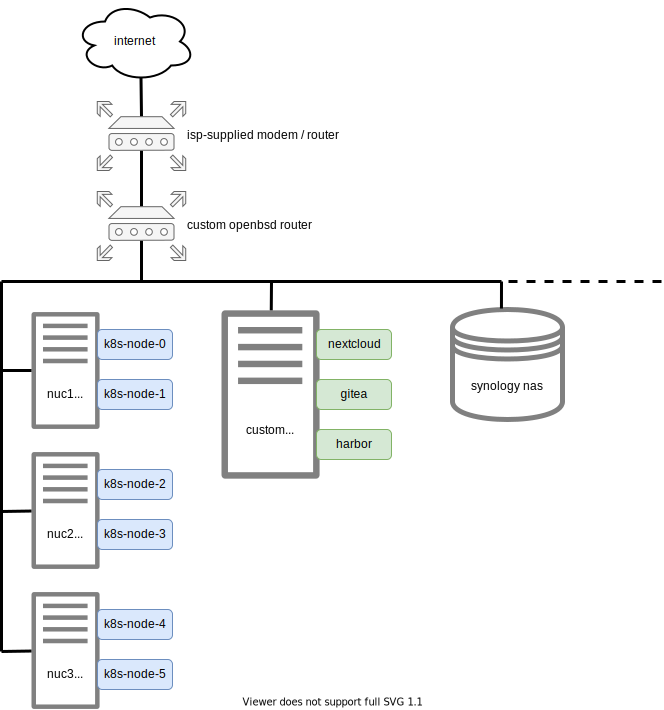

+++
title = "Ansible-defined Homelab"
+++

## Overview
Around November of last year, I started a project to wrangle my digital life. Tired of haphazardly increasing my subjectivity by trusting "free" websites to provide various services, I wanted to wrest some control over my internet existence. I made a plan to self-host several "critical" services on my home network and maintain them personally. In short, I made a homelab.

To be frank, the professional websites that I was previously dependent upon are undoubtedly more reliable than my cobbled-together hobby project of a homelab. However, on general principle (and because it seemed like a fun way to learn some sysadmin / devops skills), I made this setup:

As you can see, I have deployed a couple of general-purpose compute platforms: 4 ESXi hypervisors, and a Kubernetes cluster. Additionally, there are several VM-based services: Nextcloud, Gitea, and Harbor. For data storage and backup, I use a Synology NAS. Finally, a custom OpenBSD-based router provides internet connectivity to everything. In order to reduce operational overhead, I crafted [a set of Ansible scripts](https://github.com/0xC45/homelab-setup) that deploy and configure all of these components.
 
Overall, making this setup has been quite a journey. In this blog post, I will describe my uses for each of these services, share my thoughts and experiences so far, and attempt to articulate my future improvement plans.

## Motivation
Of course, everything you see above already exists as a service on the internet. If my goal were solely the end feature set, it would have been much simpler to pay for each service. In most cases, there are even "free" versions available. For example, if I only cared about having access to a web-based git repository UI, I could have signed up for a Github or Gitlab account rather than bother setting up a Gitea VM on my home network.

However, like most of my hobby projects, this endeavor was more about the journey than the destination. By setting up these services on my home network, I learned a bunch of useful devops and sysadmin skills. Additionally, by running my own services, I have achieved the philosophical goal of reducing my reliance on 3rd party services. Now, if any of the services that I rely upon break, I am empowered to fix them.

## Components
So, without further ado, let's dive into each of the components that make up my homelab. For each component, I will describe the main utility it provides me, why I chose it, and any additional commentary that may be helpful.

### Router
The first component of my homelab is a custom OpenBSD-based router. It provides internet connectivity and DHCP to everything on my home network. Additionally, the device serves as a caching DNS server and firewall. I could write an entire blog post describing this router in excruciating detail. In fact, I [already have](https://0xc45.com/blog/openbsd-home-router/).

### ESXi Hosts
In total, I maintain four physical [ESXi](https://www.vmware.com/products/esxi-and-esx.html) hosts to form a platform for running virtual machines on my network.

Three of the ESXi hosts are Intel NUCs (System76 Meerkats). These smaller machines run the VMs that form my Kubernetes cluster.

The other ESXi host is a custom machine built from spare parts. It currently runs three VM-based HTTPS services: Nextcloud, Gitea, and Harbor. Because it only runs three (relatively small) VMs, it has quite a bit of spare compute power leftover for future additions and/or temporary experiments.

I chose ESXi to run my virtual machines because it's enterprise quality and free. There are many hypervisors out there. For my current use case, ESXi is perfect. Also, in the future, I may consider expanding my use of VMware products by running vCenter to programmatically manage virtual machines, setting-up vSAN for shared storage, and potentially installing NSX if my networking requirements become more complicated. So, there is room to grow.

### Kubernetes Cluster
In addition to the VM-based compute platform provided by ESXi, I run Kubernetes to provide a container-based compute platform. Though I do not currently use my Kubernetes cluster for anything, I have plans to setup [Argo CI/CD](https://argoproj.github.io/), experiment with [kNative](https://knative.dev/), develop some operators, and maybe run a [factorio game server](https://github.com/helm/charts/tree/master/stable/factorio).

The Kubernetes cluster consists of 6 VMs running across 3 Intel NUCs. I chose to install Kubernetes on VMs with the ESXi hypervisor layer for ease of management. At some point, I'm sure to break things, want to reconfigure, etc. With the hypervisor, it's easier to perform these type of adjustments. Furthermore, at some point in the future, I may switch to [TKG](https://tanzu.vmware.com/kubernetes-grid), a vSphere-integrated distribution of Kubernetes.

### Synology NAS
For backups and storing important data, I use a [Synology NAS](https://www.synology.com/en-global/products/DS218+). Though I didn't really shop around and compare NAS products / vendors, I am happy with the Synology so far. That being said, I would like to create my own NAS from scratch at some point in the future. However, the Synology product includes several features "out-of-the-box" that would be potentially difficult to replicate.

First, it has an easy-to-use application called ["Active Backup for Business"](https://www.synology.com/en-us/dsm/feature/active_backup_business) that can automatically take backups of ESXi virtual machines following configurable schedules and retention policies.

The VM backup application pairs nicely with the automatic cloud backup application, ["Glacier Backup"](https://www.synology.com/en-us/dsm/packages/GlacierBackup). Every night, after the VMs are backed-up to the NAS, I replicate the backups to Amazon S3 Glacier. Hopefully, this way I won't ever lose data.

Finally, the Synology has built-in UPS integration. If [my UPS](https://www.apc.com/shop/us/en/products/APC-Power-Saving-Back-UPS-Pro-1500/P-BR1500G) loses power for more than one minute, the NAS will cleanly shutdown, preventing any data corruption that could be caused by an unexpected power loss.

### Nextcloud VM
I use [Nextcloud](https://nextcloud.com/) as my "personal cloud". I use it to store my important files and photos. The desktop / mobile application synchronizes the files across all of my devices, allowing me to edit and view my files from anywhere. 

Nextcloud also has the capability to install "apps" that provide additional functionality. Currently, I have only installed one app, ["Deck"](https://apps.nextcloud.com/apps/deck). Deck is a Kanban-style project management and organization tool. I use Deck to plan, organize, and record progress on my hobby projects.

Because it gives me the capability to install (and potentially create) apps, Nextcloud is an extensible platform. It's open source and under active development. Though the recent major version upgrade was a bit rocky (for me, at least), I'm happy with Nextcloud and plan to stick with it.

### Gitea VM
Of course, I need a place to store my code. For that purpose, I use [Gitea](https://gitea.io/en-us/). I prefer Gitea to Gitlab because it's lighter-weight. Unlike Gitlab, there aren't a million additional features bundled-in that add bloat (in my opinion). Also, I slightly prefer the Gitea UI over the Gitlab UI.

There's really not much else to say about Gitea. It works great for my purposes. I push all of my code to the Gitea VM running on my home network. Whenever I want to "publish" a project or share it with the world, I push my code to a public Github repo.

### Harbor VM
To make container images available for running on my Kubernetes cluster, I need a container registry. For this purpose, I use [Harbor](https://goharbor.io/), an open source solution that seems to be the current most popular self-hosted container registry. In addition to providing a standard API for pushing/pulling container images, Harbor has the useful capability to scan container images for known vulnerabilities.

Harbor has worked well for me so far, but I haven't really placed it under a serious workload. Soon, I will start using my Kubernetes cluster for various projects, which will require pushing / pulling images from Harbor on a regular basis. Perhaps, at some point in the future, I will have a more nuanced opinion of Harbor.

## Future Improvements
Though I am happy with the current setup, I continually find myself coming up with ideas for potential improvements and additions to the homelab. Here are a couple of the more well-defined ideas.

First, I want to install [Argo](https://argoproj.github.io/) on the Kubernetes cluster to run pipeline-based workflows. For example, it could be useful to automatically run tests for every commit that gets pushed to my repositories on Gitea. More generally, I could configure Argo to trigger a job for any arbitrary external event. It could be used to create a notification service. Or, it could be used to manage heavy workloads. There are endless potential uses for a pipeline-based workflow engine such as Argo.

Second, I want to create a dashboard that provides a graphical representation of the status of each of my homelab components using [Grafana](https://grafana.com/). Using various open-source tools, I could collect metrics and aggregate them. Then, using Grafana, I could visualize the data. It would be useful to be able to quickly ascertain the state of my home network services in order to understand workloads, diagnose issues, etc.

## Conclusion
With the work spanning several months, creating my homelab has been quite a journey. Along the way, I started to grow weary, concerned that I had signed myself up for the all-consuming task of operating my homelab. With the overhead required to maintain all the various components, how could I ever have time for anything else? However, I'm happy to report that the Ansible script automation has proved worthwhile. Now, upgrades, configuration changes, and various "day 2" operations are quick and simple. At this point, I'm looking forward to shifting gears and working on something else for a while, using my homelab services as helpful tools along the way.

## Links
1. Homelab Ansible scripts: [https://github.com/0xC45/homelab-setup](https://github.com/0xC45/homelab-setup)
1. "OpenBSD Home Router" blog post: [https://0xc45.com/blog/openbsd-home-router/](https://0xc45.com/blog/openbsd-home-router/)
