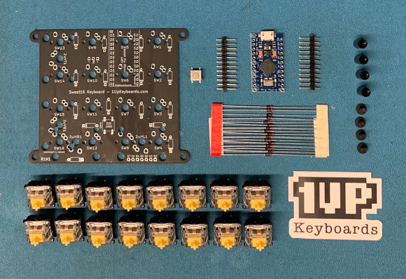
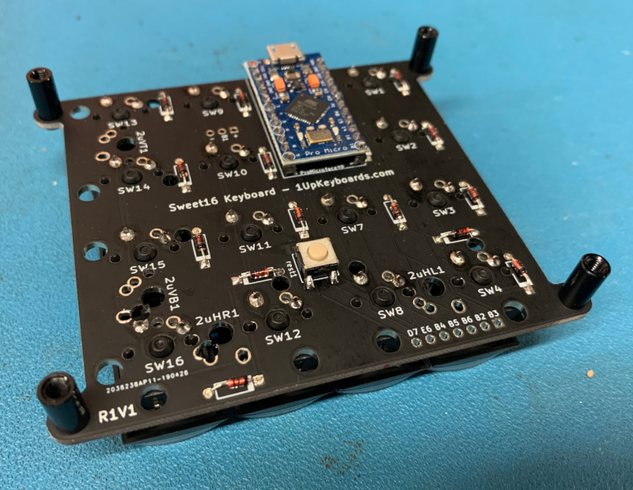
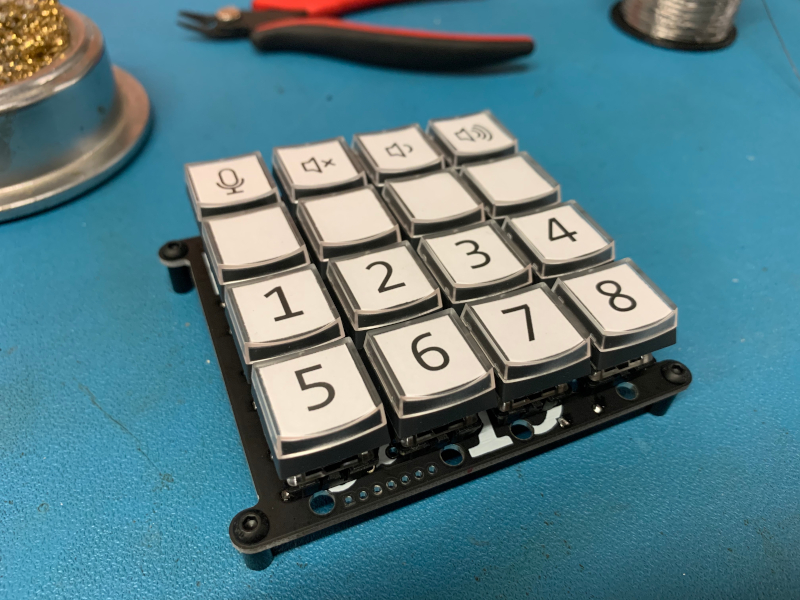

+++
title = "4x4 Macro Pad"
+++

## Overview
Last weekend, I built a 4x4 keyboard kit. By this point, many people are familiar with the growing (and outspoken) mechanical keyboard hobbyist community. However, this kit is a bit unique. It's not a full keyboard. Instead, it's a 4x4 "macro pad" intended for sending keyboard shortcut sequences such as muting my microphone, muting my audio, volume up, volume down, etc. Additionally, with some extra software such as AutoHotKey, vastly complex programs could be triggered with the press of a button.


## Build Process
Overall, building the macro pad was a simple and straightforward process. The [kit's build guide](https://www.1upkeyboards.com/instructions-downloads/sweet-16-instructions/) provides a nice set of instructions with pictures to explain things. However, unlike many (some?) keyboard kits, the Sweet 16 kit requires soldering a few smaller components, such as the diodes and microcontroller headers. Additionally, the kit requires soldering one "surface-mount" component, the reset switch.

The parts:


Completed build:



## Flash Firmware
To program my custom keymap (including multiple keypress macros), I used [QMK firmware](https://qmk.fm/), the most popular keyboard firmware project.

Using QMK, it's possible to create custom keycodes that, when pressed, trigger a sequence of inputs. So, by pressing one button on the macro pad (or keyboard), the firmware will submit an entire sequence of keycode presses.

To do this, I defined my custom keycodes in an enum:
```c
enum macro_keycodes {
  MICMUTE = SAFE_RANGE,
  MACRO1,
  MACRO2,
  MACRO3,
  MACRO4,
  MACRO5,
  MACRO6,
  MACRO7,
  MACRO8
};
```

Next, I defined a "keymap" array. Each position in the array corresponds to a single button on the 4x4 macro pad:
```c
const uint16_t PROGMEM keymaps[][MATRIX_ROWS][MATRIX_COLS] = {
  [0] = LAYOUT_ortho_4x4( /* Base */
    MICMUTE, KC_MUTE, KC_VOLD, KC_VOLU,
    XXXXXXX, XXXXXXX, XXXXXXX, XXXXXXX,
    MACRO1,  MACRO2,  MACRO3,  MACRO4,
    MACRO5,  MACRO6,  MACRO7,  MACRO8
  ),
};
```

Lastly, I implemented the `process_record_user` function to define what should happen when each custom keycode is pressed:
```c
bool process_record_user(uint16_t keycode, keyrecord_t *record) {
  switch (keycode) {
  case MICMUTE:
    if (record->event.pressed) {
      SEND_STRING(SS_LCTL(SS_LALT(SS_LSFT(SS_TAP(X_F10)))));
    }
    break;
  case MACRO1:
    if (record->event.pressed) {
      SEND_STRING(SS_LCTL(SS_LALT(SS_LSFT(SS_TAP(X_F1)))));
    }
    break;
  /*
   * ... etc
   */
  }
  return true
}
```

As you can see, I have configured the `MICMUTE` button to send the entire sequence `CTRL+ALT+SHIFT+F10`. However, in practice, any arbitrary sequence could be sent for any button. And, that's only beginning to scratch the surface of the capabilities of the QMK firmware.


## Design Keycaps
For this "DIY" kit, it felt important to design my own icons. I'm no graphic designer, but it was kinda fun. To do this, I used "re-legendable" keycaps that snap together with a clear top. Then, I printed the icons on plain white paper, cut them out, and sandwiched each icon in the keycaps. Here's a photo of my efforts:




## Conclusion
This was a pretty quick project, but I felt like it deserved a writeup nevertheless. As a relative beginner at soldering, this kit was a fantastic way to increase my skills and ability beyond the "absolute beginner" level required for most keyboard kits. Furthermore, the final product is quite useful and extensible. Beyond the specific purpose as a simple macro pad keyboard, this hardware is essentially a microcontroller connected to a set of buttons. There are numerous possible applications. It's ripe for hacking. This device could become a MIDI controller, home automation remote, or anything else my imagination might dream up. Until next time.


## Links
1. Sweeet 16 Macro Pad Kit: [https://www.1upkeyboards.com/shop/keyboard-kits/macro-pads/sweet-16-macro-pad-black/](https://www.1upkeyboards.com/shop/keyboard-kits/macro-pads/sweet-16-macro-pad-black/)
1. QMK Firmware: [https://qmk.fm/](https://qmk.fm/)
1. My Sweet 16 Keymap: [https://github.com/0xC45/qmk-firmware/blob/master/keyboards/1upkeyboards/sweet16/keymaps/0xC45/keymap.c](https://github.com/0xC45/qmk-firmware/blob/master/keyboards/1upkeyboards/sweet16/keymaps/0xC45/keymap.c)
