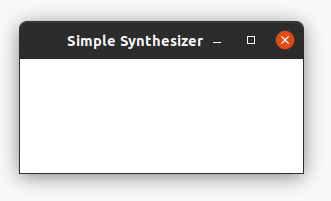
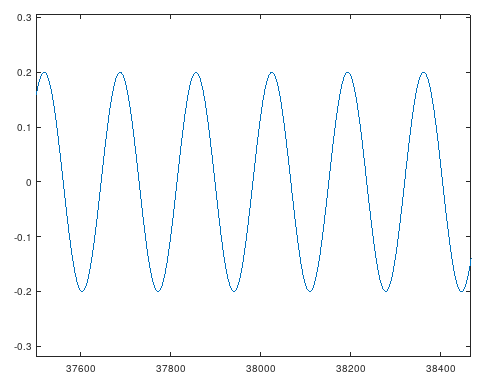
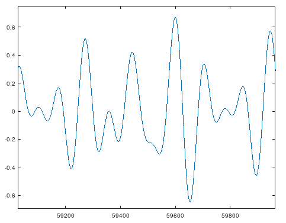

+++
title = "Digital Audio Synthesizer in Rust"
+++

## Overview
Over the past couple weekends, I built a digital audio synthesizer in rust. It is controlled via the keyboard, with the bottom two rows emulating piano keys. Since there are fewer keyboard buttons than piano keys, you can specify which octave to play via a command line argument. For some extra fun, you can also specify which waveform to synthesize (sine, square, triangle, or sawtooth). Lastly, it is polyphonic, meaning it supports playing multiple notes at the same time (keyboard hardware / firmware permitting). [Here](https://github.com/0xC45/simple-synth) is a link to the code.


## How Does it Work?
In theory, digital audio synthesis is fairly straightforward. To create sound, send a series of digital values to the sound card that represent the relative position of the speaker cone at each instant in time. These digital values are converted to analog electric signals by the sound card, which get transformed into sounds via the motion of the speaker cone.


This simple synthesizer is able to generate 4 distinct types of sounds (waveforms) by oscillating the speaker(s) in different ways. It receives button press events from the keyboard, determines what frequency (or "note") that key represents, then computes a waveform that oscillates at the desired frequency.

On startup, the program launches two threads: graphics and audio.


### Graphics
Currently, the only job of the graphics thread is to create a window for the program, receive keyboard events, translate keyboard events to "midi" note on / off events, and send the midi events to the audio thread. It does not yet display a useful GUI for the synthesizer.



To draw the window and collect keyboard events, I decided to use the [piston](https://crates.io/crates/piston) game engine library. This is a popular library that abstracts a bunch of the platform-specific details away. It should be easy to use this library to eventually make a useful UI.

To send note on / off events to the audio thread, I employed the [crossbeam](https://crates.io/crates/crossbeam) library's bounded channel. This is far from an optimal solution. Production quality audio engines utilize lock-free data structures (such as lock-free circular queues), self-managed heaps, and atomic data access. See [this video](https://www.youtube.com/watch?v=boPEO2auJj4) for a good overview of these concepts. Real-time guarantees would be a good area of future exploration to improve this synthesizer and my general rust language knowledge.


### Audio
The majority of the work for this program is done in the audio thread. To generate sound, I use [CPAL](https://crates.io/crates/cpal), a cross-platform audio library for Rust. The API this library provides was a bit bizarre to me at first. However, after doing some more research about audio programming, it seems to be the standard way of interacting with sound cards.

As a user of CPAL, you provide a callback function (closure, actually). On regular intervals, the audio callback function is run, which must fill in the next chunk of digital audio values. For each note that is currently being played, the synthesizer generates values that correspond to a waveform. For example, here is a plot of a simple sine wave that was generated by this synth (plotted with gnu octave):



To play this sound, the audio loop computes all of the "y" values for this waveform and dumps them into the audio buffer. To support polyphony (playing multiple notes at once), all of the values for each of the notes are added together. The resulting waveform may be quite complex. For example, here is the waveform of a simple 3-note chord (triad).



Here is the core loop that computes and generates the various waveforms:
```rust
let mut value = 0_f32;

for (_, mut note) in active_notes {
    // increment the note clock
    note.envelope.clock = note.envelope.clock + 1_f32;

    // compute common values
    use std::f32::consts::PI;
    const TAU: f32 = 2_f32 * PI;
    const AMPLITUDE_MODIFIER: f32 = 0.2;
    let period = note.envelope.clock / audio_ctx.sample_rate;

    // determine next sample value
    let sample = match note.waveform {
        Waveform::SINE => (note.frequency * TAU * period).sin(),
        Waveform::SQUARE => match (note.frequency * TAU * period).sin() {
            i if i > 0_f32 => 1_f32,
            _ => -1_f32,
        },
        Waveform::TRIANGLE => (note.frequency * TAU * period).sin().asin() * (2_f32 / PI),
        Waveform::SAWTOOTH => (((note.frequency * period) % 1_f32) - 0.5) * 2_f32,
    };

    // add sample to final value
    value += sample * AMPLITUDE_MODIFIER;
}

value
```

For each note, the internal "clock" is incremented. This is the x axis for the graphs above. Then, based on the required waveform, the next y value is computed. All of the values are scaled based on some modifier (to reduce volume and allow multiple notes to be played at once). Each note's value is added to produce the final value for the instant.

Based on a typical sample rate of 44.1 kHz, this loop must run 44,100 times a second. Therefore, it's essential to ensure that the audio callback function is highly efficient and maintains predictable runtimes. Otherwise, the audio stream will drop and there will be noticable clicks / pops in the sound.


## Next Steps
There are many ways that I plan to improve this synthesizer:

1. Improve latency

    Currently, there is a slightly noticable latency between when you press a key on the keyboard and when the sound starts. This can be improved by optimizing the audio callback function and reducing the audio buffer size (so there is less latency). It may be necessary to employ a lock-free data structure to handle communication between the graphics and audio threads. In general, the audio callback function needs to be optimized for speed and to ensure a predictable runtime.

2. Add GUI elements

    There is a GUI window, but it currently does not display anything. To improve user experience, the key presses should have some visual feedback. Also, it would be nice to be able to configure the waveform, envelope, etc. via some UI elements.

3. Add configurable envelope

    To make more interesting sounds, I want to add configurable "envelopes" for the notes. The envelope is the relative amplitude (or volume) of the waveform over time. For example, a piano key is loud initially, then fades slowly.

4. Ecosystem integration

    By turning this program into an actual MIDI receiver, it will be possible to send MIDI events that trigger sounds from outside sources, such as a physical piano keyboard or fun programs like [Orca](https://github.com/hundredrabbits/Orca).
    
5. Embedded (?)

    It would be cool to run this code on some embedded system and create a standalone digital audio synthesizer.


## Conclusion
This has been an interesting project. Before, I had extremely fuzzy / incomplete digital audio knowledge. What is a sound wave? How do speakers work? Now, I know enough to make simple noises and tones. Looking at youtube videos of electronic music production, modular synthesizers, and DIY analog synths, I am astounded at the complexity of sounds that people can produce by combining these basic elements. There is a lot more to explore in this space.


## Links
- Code for this project on Github: [https://github.com/0xC45/simple-synth](https://github.com/0xC45/simple-synth)
- CPAL - Rust cross-platform audio crate: [https://github.com/RustAudio/cpal](https://github.com/RustAudio/cpal)
- Piston - Rust game engine crate: [https://crates.io/crates/piston](https://crates.io/crates/piston)
- Crossbeam - Rust concurrent programming crate: [https://crates.io/crates/crossbeam](https://crates.io/crates/crossbeam)
- CppCon 2015: Timur Doumler “C++ in the Audio Industry”: [https://www.youtube.com/watch?v=boPEO2auJj4](https://www.youtube.com/watch?v=boPEO2auJj4)
- Orca - esoteric procedural sequencer livecoding environment: [https://github.com/hundredrabbits/Orca](https://github.com/hundredrabbits/Orca)
- Making sounds using SDL and visualizing them on a simulated oscilloscope: [http://nicktasios.nl/posts/making-sounds-using-sdl-and-visualizing-them-on-a-simulated-oscilloscope.html](http://nicktasios.nl/posts/making-sounds-using-sdl-and-visualizing-them-on-a-simulated-oscilloscope.html)
- Code-It-Yourself! Sound Synthesizer #1 - Basic Noises: [https://www.youtube.com/watch?v=tgamhuQnOkM](https://www.youtube.com/watch?v=tgamhuQnOkM)